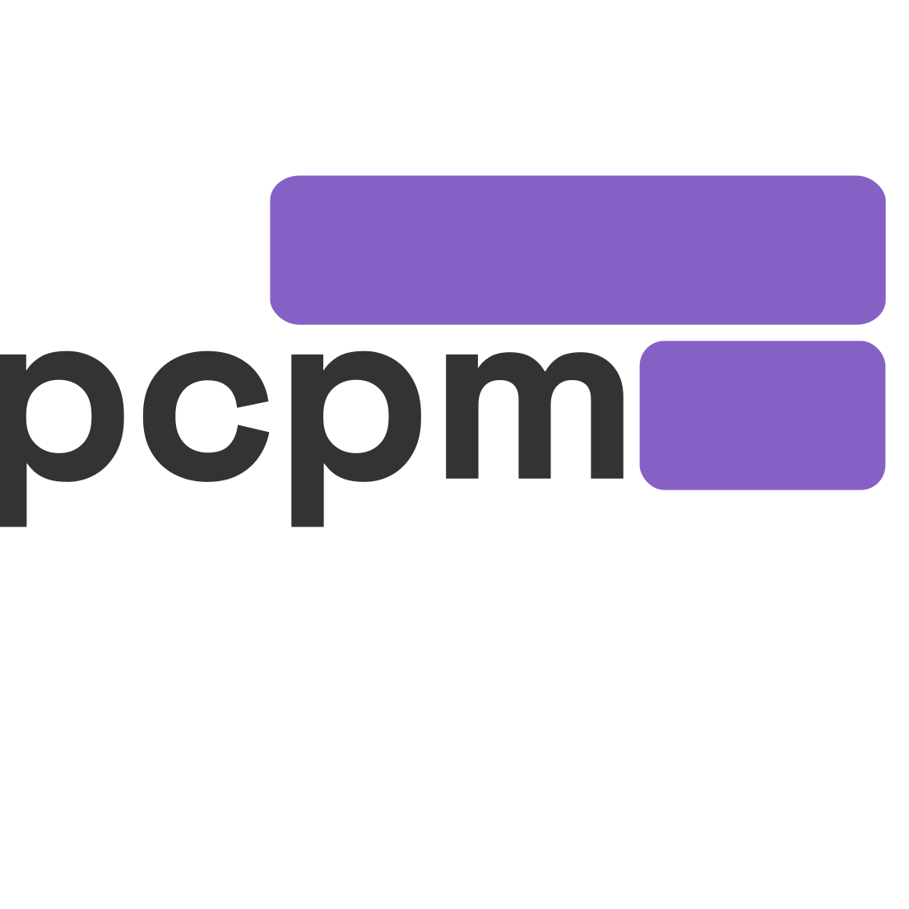

# pcpm


> Fast, deterministic, pnpm-style package manager for .NET, built on Central Package Management.

`pcpm` brings the parts of pnpm that actually move the needle to .NET:

- a **content-addressable global store** (download once, hash once, never again),
- **NTFS / APFS / ext4 hardlinks** into `~/.nuget/packages` (zero-copy materialisation),
- a **content-hashed lockfile** (`pcpm.lock`) for byte-identical builds,
- **strict, non-flat resolution** with union-of-constraints BFS,
- **no new manifest format** — it writes the same `Directory.Packages.props` and
  `<PackageReference />` you already use.

It is a thin layer on top of the .NET SDK. `dotnet restore` still does the
restore. MSBuild still does the build. The only thing that changes is where
the package bytes come from and how their versions are pinned.

## What it does for you, concretely

These are the things people actually switch to pcpm for.

### 1. Cuts the on-disk NuGet cache by 70–90% on multi-project solutions

Without pcpm, every distinct `(id, version)` pair is unpacked once **per
project** in `~/.nuget/packages`. On a 30-project monorepo with 200 unique
packages, that is ~8 GB of duplicated bytes even though the contents are
byte-identical.

With pcpm, every distinct `.nupkg` lives **once** in a content-addressable
store (`%LOCALAPPDATA%\pcpm\store` on Windows,
`~/.local/share/pcpm/store` elsewhere). `pcpm install` hardlinks it into
`~/.nuget/packages` so `dotnet restore` still sees a normal layout.

The store doesn't grow with the number of projects. Adding a 31st project
that uses the same 200 packages adds zero bytes to the store.

### 2. Reproducible builds, actually enforced

`pcpm.lock` records the resolved version **and** the sha256 of the `.nupkg`
for every entry. The same lockfile on every machine, every commit, every CI
run produces the same bytes.

`pcpm ci` is the build-server command. It refuses to proceed if
`pcpm.lock` is stale or missing, and it validates that every entry's hash
is present in the store. A clean CI run that suddenly resolves a new
transitive is now a build failure, not a silent regression.

### 3. Faster clean restores on CI

The first `pcpm install` downloads the world. Every subsequent install —
including on a clean CI runner with a warmed cache — only fetches the
deltas. Because the layout `dotnet restore` sees is the standard
`~/.nuget/packages` tree, the only cost is the hardlink step, which is
metadata-only.

### 4. Tells you who pulled in what

`pcpm why <package>` walks the lockfile and shows the full chain of
dependents that brought `<package>` into your build. When a transitive bump
surprises you, you know exactly which direct dependency to negotiate with.

### 5. Diagnoses your CPM setup before CI does

`pcpm doctor` runs a battery of checks against the current workspace and
exits non-zero on real problems:

- `ManagePackageVersionsCentrally` is set,
- no floating versions (`1.0.*`, `*`) in `Directory.Packages.props`,
- no `<PackageReference Version="…" />` left over from a pre-CPM era,
- no orphaned CPM entries (declared but unused),
- no missing CPM entries (referenced but undeclared),
- the lockfile is in sync with the workspace,
- known CVEs from the NuGet feed (opt-out with `--no-cve`).

Exit code 1 = errors, 2 = warnings, 0 = clean. Wire it into your build
gate.

### 6. Audits security and licenses, and ships an SBOM

`pcpm audit` scans the resolved graph against known vulnerability
advisories and license metadata. `--output <dir>` writes a CycloneDX SBOM
plus a license report. Run it locally or in CI; both `--no-sbom` and a
JSON output mode are available for piping.

### 7. Migrates existing solutions in one command

`pcpm convert` walks a solution (with or without CPM) and rewrites it in
place: hoists every per-project `Version=` into a `<PackageVersion />`,
adopts an existing `Directory.Packages.props` if present, and writes
`pcpm.json` + `pcpm.lock`. `--dry-run` previews the diff. `--revert` undoes
it.

## Quick start

```bash
# 1. Build pcpm (the repo is self-hosted, no NuGet publish yet)
dotnet build pcpm/pcpm.slnx

# 2. In your .NET repo's root
pcpm convert                     # migrate an existing solution, or…
pcpm init                        # …start from scratch in a new workspace

pcpm add Serilog                 # adds the latest stable to CPM + .csproj
pcpm install                     # resolves, hashes, hardlinks, dotnet restore

pcpm list                        # pretty-prints pcpm.lock
pcpm why Serilog                 # shows who pulls it in
pcpm doctor                      # CPM + lockfile + CVE sanity check
pcpm audit                       # vulnerabilities + license report + SBOM
pcpm outdated                    # newer versions on the feed
pcpm ci                          # strict install for CI
pcpm store status                # disk usage of the global store
```

## Commands

| Command                    | What it does                                                                                                  |
|----------------------------|---------------------------------------------------------------------------------------------------------------|
| `pcpm init`                | Initialise a workspace (`pcpm.json`, `Directory.Packages.props`; `pcpm-workspace.yaml` for monorepos).         |
| `pcpm add <pkg>`           | Add a direct dependency. `--version <v>`, `--project <path>`, `--no-install`.                                |
| `pcpm install` (alias `i`) | Resolve the graph, materialise the store, hardlink to `~/.nuget/packages`, run `dotnet restore`.             |
| `pcpm remove <pkg>`        | Remove from CPM and every referencing `.csproj`.                                                             |
| `pcpm list` (alias `ls`)   | Pretty-print `pcpm.lock` as a table.                                                                          |
| `pcpm why <pkg>`           | Show the chain of dependents that pulls `<pkg>` into the lockfile.                                            |
| `pcpm outdated`            | Query the feed for newer versions, report bump type (major / minor / patch).                                 |
| `pcpm doctor`              | CPM, floating versions, hardcoded `Version=`, orphans, missing entries, CVE feed, lockfile sync.             |
| `pcpm audit`               | Vulnerabilities, license audit, optional CycloneDX SBOM (`--output <dir>`, `--no-sbom`).                     |
| `pcpm convert`             | Migrate an existing solution to CPM + pcpm. `--dry-run`, `--revert`, `--workspace`.                          |
| `pcpm store`               | `status`, `path`, `prune` — inspect and manage the global store.                                               |
| `pcpm ci`                  | Strict, fail-fast install. Verifies lockfile sync, restores from store, runs `dotnet restore`.               |

## How the store works

```
%LOCALAPPDATA%\pcpm\store\
  v1\
    <sha256-prefix>\
      <sha256>\
        pkg.nupkg                # immutable copy
        extracted\
          <id>\<version>\lib\net10.0\…
```

1. `pcpm install` downloads each resolved `.nupkg` once, hashes it, and
   stores it under its content hash.
2. The package is then **hardlinked** (NTFS / APFS / ext4) into the
   standard `~/.nuget/packages/<id>/<version>/` layout. Two directory
   entries, one set of bytes, zero extra disk.
3. `dotnet restore` reads the standard layout; nothing about the
   consumer side is custom.
4. `pcpm.lock` records the resolved version and the sha256 of the
   `.nupkg`. The store is content-addressed, not path-addressed: a
   lockfile can be replayed on any machine that has the same hashes.

If the source and target volumes differ, or the filesystem doesn't
support hardlinks, pcpm falls back to a normal file copy.

## Architecture

```
┌─────────────────────────────────────────────────────────────────┐
│  pcpm.Cli           Spectre.Console.Cli commands (one per verb)  │
│  ─────────          thin orchestration only                      │
└────────────────────────┬────────────────────────────────────────┘
                         │ DI
┌────────────────────────┴────────────────────────────────────────┐
│  pcpm.Core           domain models, abstractions, pure logic    │
│  ────────            DependencyResolver, no I/O                 │
└────────────────────────┬────────────────────────────────────────┘
                         │
┌────────────────────────┴────────────────────────────────────────┐
│  pcpm.Infrastructure  NuGetFeed (raw HTTP), PackageStore         │
│  ──────────────────   (content-addressable), HardlinkCreator    │
│                       (Win32 P/Invoke), CpmFileService,         │
│                       LockfileService, ProjectFileService,      │
│                       ConvertService, …                         │
└─────────────────────────────────────────────────────────────────┘
```

`pcpm.MsBuild` ships an opt-in MSBuild task (`RelinkBin`) that re-hardlinks
the output of `dotnet build` to the store, so `bin/` on CI doesn't grow
with each build.

Why this layout:

- `pcpm.Core` has zero I/O. Every domain rule — version parsing, range
  reduction, conflict detection — is testable in isolation, and the
  abstractions it defines are the actual contract. Drop in an
  in-memory store or a fake feed for unit tests.
- `pcpm.Infrastructure` is the only place that touches the disk or the
  network. Small surface, easy to audit.
- `pcpm.Cli` is orchestration. `InstallCommand` is wired with
  `CpmFileService`, `ProjectFileService`, `ProjectDiscovery`,
  `NuGetFeed`, `PackageStore`, `LockfileService`, `DependencyResolver`,
  `ProcessRunner`, `IAnsiConsole` through constructor injection.

## Build & test

```bash
dotnet build pcpm/pcpm.slnx
dotnet test  pcpm/tests/pcpm.Tests
```

The test suite covers:

- `PackageId` / `PackageVersion` validation
- `DependencyResolver` happy path, transitive resolution, conflict detection
- `CpmFileService` round-trips and user-property preservation
- `ProjectDiscoveryService` glob patterns and `pcpm-workspace.yaml` overrides
- `LockfileService` read / write / hash verification

## Roadmap

- `pcpm update [pkg]` — bump one or all packages, re-resolve, re-materialise
- Cross-platform symlink store (non-Windows, non-APFS zero-copy)
- Optional offline / vendored mode (no network, store only)
- TFM-aware dependency group selection (real `NuGet.Frameworks` compatibility reduction)

## License

MIT.
